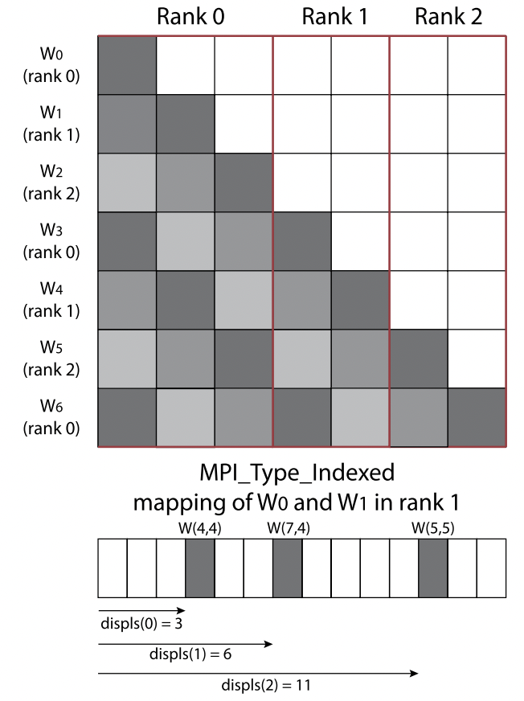
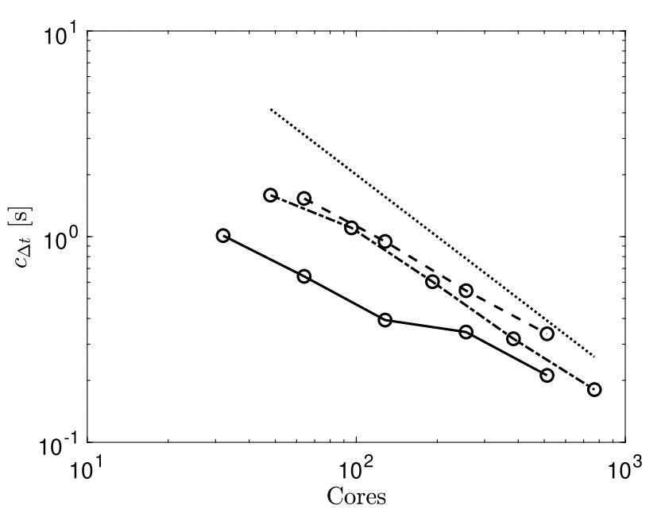
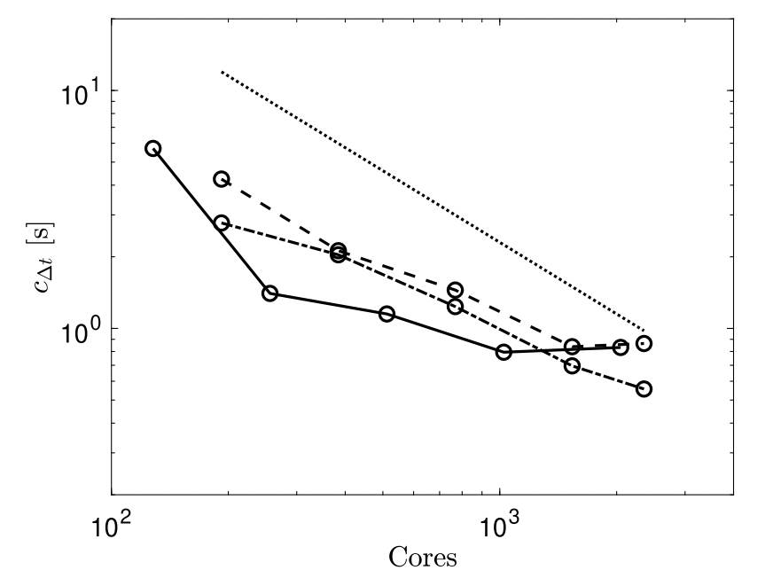
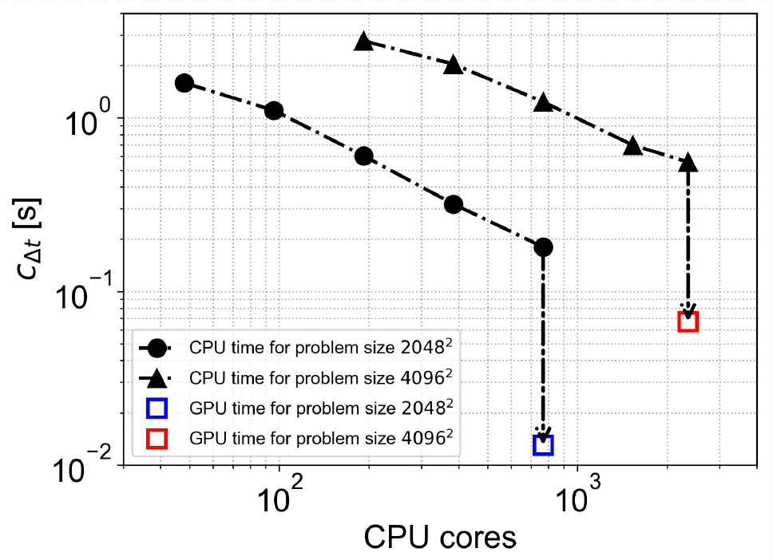
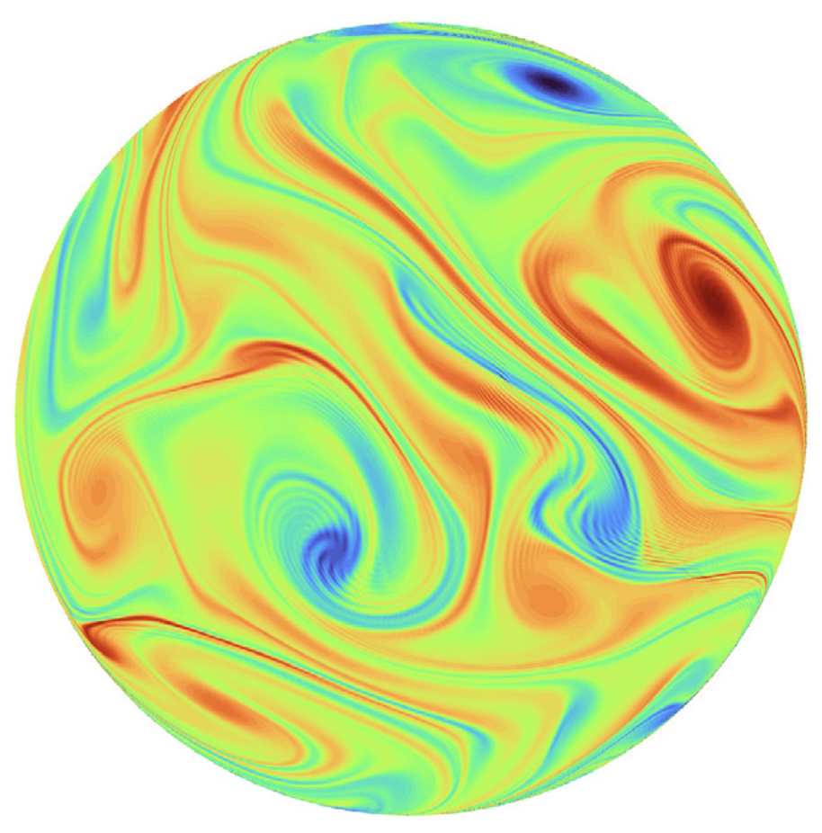
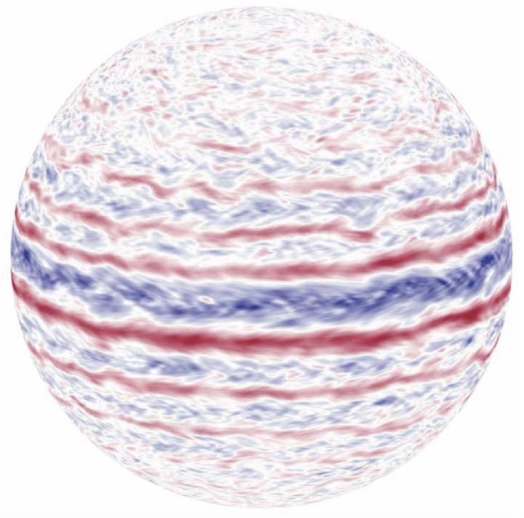

# Planetary Flow

This section summarizes an efficient and highly-scalable solver developed for the simulation of **geophysical flows** on a spherical surface (see [1] and [2] for details). The original implemention presented in [1] was based on an hybrid MPI-OpenMP parallelization. More recently, I have developed a **GPU-accelerated** version to conduct cutting-edge research in the group of prof. Klas Modin at Chalmers University. A 10x speedup was achieved compared to the already massively parallelized CPU version. 

## 1. Problem setup

Two-dimensional hydrodynamics possess geometric properties that affect its qualitative long-time behaviour. In particular, there exist infinitely many first integrals, called Casimir functions. Physically, they state the conservation of the integrated powers of vorticity and reflect that vorticity is advected along stream-lines. There is strong evidence that the long-time qualitative dynamics of non-viscous two-dimensional fluids is tied to the conservation of Casimirs. To better capture the correct long-time behaviour it is therefore natural to construct numerical methods that preserve these conservation laws. 

Consider, as a prototype model, the Euler flow on the sphere governed by the euqations

$$
\begin{cases}
\dot{\omega} = \lbrace \psi, \omega \rbrace, \qquad (1.0) \\
\Delta \psi = \omega,
\end{cases}
$$

where $\psi$ is the stream-function, related to vorticity $\omega$ via the Laplace-Beltrami operator $\Delta$, and $\lbrace \cdot,\cdot \rbrace$ is the Poisson bracket. The construction of a numerical scheme that embeds a Lie-Poisson structure and its conservation laws requires a finite truncation of the Poisson bracket. This subject relates to concepts of differential geometry, for which I refer the reader to [^1]. In brief, there exists a rigorous procedure to approximate smooth functions on the sphere by finite-dimensional matrices in the unitary group $\mathfrak{u}(N)$. By doing so, one obtains a spatial discretization of (1.0) in the matrix form

$$
\begin{cases}
\dot{W} = [P, W], \qquad (1.1) \\
\Delta_N P = W,
\end{cases}
$$

where $W \in \mathfrak{su}(N)$ is the vorticity matrix, $P \in \mathfrak{su}(N)$ is the stream matrix and $\Delta_N$ a discrete Laplacian. System (1.1) preserves $\text{Tr}(W^k)$ for $k=1,...,N$, which corresponds to the integrated powers of vorticity in the continuum. 

From a numerical standpoint, the three main components are:

* the computation of matrix multiplications stemming from the commutator,
* the construction of the Lie-algebra basis,
* the computation of the inverse Laplacian.

The matrix multipliucation will dominate the computatinal complexity being $\mathcal{O}(N^3)$. The other two points require the solution of eigenvalue problem and of a linear system. As it stands, the problem is prohibitevly expensive, since the Laplacian matrix is a forth-order tensor. However, $\Delta_N$ admits a tridiagonal splitting into $(2N-1)$ block of size $N-|m|$ corresponding to the $m$th diagonal of $W$. The parallel implementation of these algorithms will be discussed in the following.

## 2. Parallel CPU implementation
Linear algebra algorithms are taken from the well-established and optimised library LAPACK [3] and its parallel extension
ScaLAPACK [4]. The parallelisation is carried out by means of MPI [5] combined with openMP multithreading [6]. We select a distribution memory layout that allows for optimal computation of matrix-matrix multiplications referred to as block-cyclic decomposition [4]. In essence, the latter assigns matrix blocks to MPI processes in a cyclic manner in order to optimise load-balance and communication across processors for dense matrix operations. 

If one dentifies $A_m$ with $m$-th diagonal of $A$ defined as the $m$-th sub-diagonal for $1 \leq m \leq N − 1$ and the main diagonal for $m = 0$. Then, the tridiagonal Laplacian acts on stream-matrix diagonal elements $P_m$ and produces vorticity-matrix diagonal elements $W_m$, i.e.,

$$
\Delta^m P_m = W_m, \quad m = 0, \dots, N - 1 \qquad (2.0).
$$

Particular care has to be taken when implementing (2.0) in a distributed memory system. As pointed out earlier, the matrix data layout is based on a block-cycling distribution, which is optimal for matrix multiplication. Therefore, the $N$ diagonals of $W$ are scattered among processors and mapped into memory in a non-trivial way. In order to extract the diagonals in a simple and efficient way, we first redistribute $W$ into a block-column memory layout. As it is clear from Fig. 1, some values of the diagonals owned by a given MPI rank are stored in the local memory of a different MPI rank. This array of values is communicated among processors using derived types `MPI_Type_Indexed`. The latter are a particularly efficient means of parallel communication when the data structure of the algorithm remains constant throughout its execution, as it is the case here. One can, in fact, encode the memory layout of the data to be transferred into the derived data type and send them across processors in a single MPI instruction, thus reducing communication to a minimum and avoiding buffering of data altogether. Furthermore, data are transferred in a non-blocking manner, by the pair `MPI_Issend`, `MPI_Irecv`, reducing waiting times.

<figure align="center">
  
  <figcaption>
    <b>Figure 1.</b> . Sketch of a matrix of size $N = 7$ distributed over three MPI processes across columns. The red boxes indicate the data local to each MPI rank. The diagonals $W_m$ of the vorticity matrix, corresponding to the tridiagonal systems (1.2), are represented by filled blocks. Wm having the same color are assigned to the same MPI rank, as indicated in the left of the figure. The construction of the MPI_Type_Indexed related to the mapping of $W_0$ and $W_3$ stored in the memory of rank 1 is shown at the bottom of the figure. The diagonal values are identified by specifying their displacement in memory as indicated by arrows at the bottom of the figure. 
</figcaption>
</figure>

The parallel performance of the algorithm was analysed on the supercomputer Galileo100 [7], which mounted Intel CPU CascadeLake 8260 equipped with 24 cores each. We carry out a scaling test for matrix size $N = 2048$ and $N = 4096$. These resolutions allow for the study of complex flows that span a wide range of scales of motion. Fig. 2 shows the computational time per time-step as a function of the number of cores. A full MPI parallelisation (solid line) is compared with an hybrid parallelisation for two different numbers of threads per MPI process equal to $12$ (dash-dotted line) and $24$ (dashed line). The best performance is found when employing $12$ threads: approximately linear scaling is observed with the lowest computational time at the largest number of cores simulated. The full MPI parallelisation appears to be more efficient for smaller matrix sizes, while it deviates from linear scaling for large $N$. Doubling the number of threads to 24 does not improve the computational time and results in an earlier departure from linear scaling compared to the case where 12 threads are employed. 

<figure align="center">
  
  
  <figcaption>
    <b>Figure 2.</b> . Computational time per time-step as a function of the number of cores, for N = 2048 (left figure) and for N = 4096 (right figure), using fully MPI parallelisation (solid line), hybrid MPI parallelisation with 12 threads (dash-dotted line) and hybrid MPI parallelisation with 24 threads (dashed line). Linear scaling is shown as a reference by the dotted line.
</figcaption>
</figure>

What ultimately matters is the computational time one can achieve by means of parallel computing. Here we show that, for $N = 4096$, a time-step is completed in around $0.55$ seconds, which in turn allows for long-time simulations and gathering of statistical quantities of the flow.

## 3. GPU-accelerated implementation
As argued in the previous section, the overall computational cost is dominated by matrix multiplication being of complexity $\mathcal{O}(N^3)$. Therefore, it is reasonable to expect good perfomance when offloading this task on modern GPU devices, which have been optimised to handle matrix-matrix multiplication. As part of my consulting, I have ported and parallelised an existing Python version of the solver to GPU. Matrix multiplication is carried out using the NVIDIA libraries `nvmath` [8]:

`nvmath.linalg.advanced import Matmul`

These are highly optimized libraries and ready to use off the shelf. For the solution of tridiagonal systems (2.0) the library `cusparse` has been employed 

`from nvmath.bindings import cusparse`.

In particular, the right-hand side of (2.0) can be conveninetly batched by concatenating pairs of diagonals $\lbrace W_i,W_j \rbrace$ of size $N$:

$$
[ \lbrace W_0 \rbrace , \lbrace W_1, W_{N-1} \rbrace, \lbrace W_2, W_{N-2} \rbrace, ...]  \qquad (2.1).
$$

Then all tridiagonal systems can be solved with a single call to the batched tridiagonal solver

`cusparse.sgtsv2strided_batch`.

Data transfer among different data structures can be done efficiently by customised CUDA kernels. The numerical simulations were executed on an NVIDIA H100 GPU platform. The results, presented in Fig. 3, are impressive. A 10x speedup, compared to the CPU solver, has been achieved at the highest simulated resolution of $N=4096$. 

<figure align="center">
  
  <figcaption>
    <b>Figure 3.</b> . Computational time per time-step as a function of the number of cores, for N = 2048 (line with dots) and for N = 4096 (line with triangles). The blue rectangle and the red rectangle are the computational times of the GPU-accelerated solver.
</figcaption>
</figure>

Moreover, while the CPU solver required thousands of cores and a complex data parallelism over distributed memory, whereas the current approach leverages a single GPU device via highly optimized, off-the-shelf NVIDIA libraries. Figure 4. shows a snapshot of vorticity for the Euler flow (left panel) and for a quasi-geostrophic planetary flow (right panel). The GPU-accelared solver is being used at Chalmers University, by the group led by prof. Klas Modin, to cunduct cutting-edge research in the field of geophysical flow and differential geometry. 

<figure align="center">
  
  
  <figcaption>
    <b>Figure 4.</b> Vorticity of Euler flow (left panel) and of a quasi-gestrophic planetary flow (right panel).
  </figcaption>
</figure>

[1]: Cifani, P., Viviani, M. and Modin, K., 2023. An efficient geometric method for incompressible hydrodynamics on the sphere. Journal of Computational Physics.

[2]: Franken, A.D., Caliaro, M., Cifani, P. and Geurts, B.J., 2024. Zeitlin truncation of a shallow water quasi‐geostrophic model for planetary flow. Journal of Advances in Modeling Earth Systems.

[3]: E. Anderson, Z. Bai, C. Bischof, S. Blackford, J. Demmel, J. Dongarra, J. Du Croz, A. Greenbaum, S. Hammarling, A. McKenney, D. Sorensen, LAPACK Users’ Guide, 3rd edition, Society for Industrial and Applied Mathematics, Philadelphia, PA, 1999.

[4]: L.S. Blackford, J. Choi, A. Cleary, E. D’Azevedo, J. Demmel, I. Dhillon, J. Dongarra, S. Hammarling, G. Henry, A. Petitet, K. Stanley, D. Walker, R.C. Whaley, ScaLAPACK Users’ Guide, Society for Industrial and Applied Mathematics, Philadelphia, PA, 1997.

[5]: W. Gropp, E. Lusk, N. Doss, A. Skjellum, A high-performance, portable implementation of the mpi message passing interface standard, Parallel Comput. 22 (1996) 789–828.

[6]: R. Chandra, L. Dagum, D. Kohr, R. Menon, D. Maydan, J. McDonald, Parallel Programming in OpenMP, Morgan Kaufmann, 2001

[7]: https://www.hpc.cineca.it/hardware/galileo100.

[8]: NVIDIA Corporation. "nvmath-python: NVIDIA Math Libraries for the Python Ecosystem." GitHub Repository, 2026. Available at: https://github.com/NVIDIA/nvmath-python.
