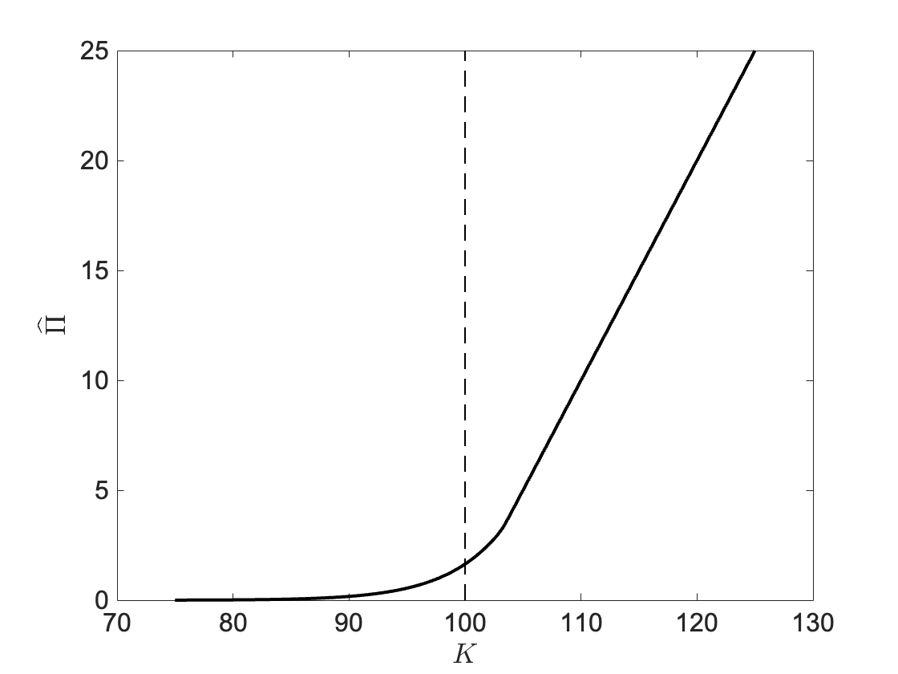
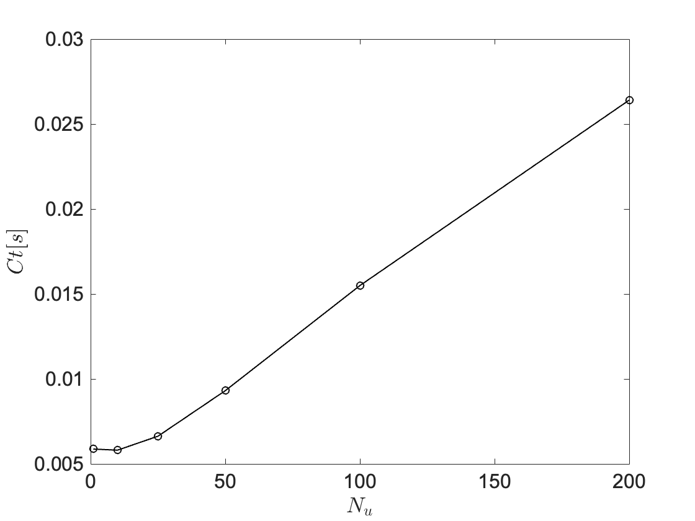

# Parallel GPU Pricing

This section illustrates two algorithms to price American put options. A GPU-accelerated demonstration is provided. 

## Least-Squares Monte Carlo

We first recall the final expression for the price of American put options (see for exmaple [^1])

$$
\widehat{\Pi}_Y(t) = \max\limits_{\tau \in \mathcal{Q}_{t,T}} \widetilde{\mathbb{E}} [ (e^{-r(\tau-t)} g(S(\tau)) | \mathcal{F}_W(t) ], \qquad (1.0)
$$

where the expectation is taken under the risk-neutral probability measure, $\mathcal{Q}_{t,T}$ is the set of all possible stopping times $\tau \in [t,T]$, $T$ is the maturity time, $S(t)$ the stock price, $g(x) = (K-x)\_+$ with $K$ the strike price and $\mathcal{F}_W(t)$ the filtration generated by Brownian motion $W(t)$. Since the underlying stock price is a Markov process (1.0) simplifies to

$$
\widehat{\Pi}_Y(t,S) = \max\limits_{\tau \in \mathcal{Q}_{t,T}} \widetilde{\mathbb{E}} [ (e^{-r(\tau-t)} g(S(\tau)) | S(t) ]. \qquad (1.1)
$$

The objective is compute a good approximation of the expectation (1.1) via a Monte Carlo estimator. The maximization is over all stopping times $\tau$, which however are random ad adapted to the filtration at the current time $t$. Thus, they cannot be inferred from future informations. A natural way to solve this problem is then to start from the maturity time and work backwards. The first step is to discretize time:

$$
0 = t_0 \leq t_1 \leq ... \leq t_N = T. \qquad (1.2)
$$

Define $\widehat{\Pi}(t_n,S(t_n)) = V\_n(S\_{t\_n})$ to be the value of the option at time $t_n$. Clearly, $V_N(s) = g(s)$, i.e. the payoff at maturity. At $t=N-1$ there are two possibilities: exercise immediately if we have reached a stopping time or compute the expectation based on the next admissible stopping time, i.e. $\tau=T$:

$$
\begin{aligned} 
V_{N-1}(s) &= \max \left( g(s), \ \widetilde{\mathbb{E}} [ (e^{-r(\Delta t)} g(S_{t_N}) | S_{t_{N-1}}=s ] \right) \\ 
&= \max \left( g(s), \ \widetilde{\mathbb{E}} [ (e^{-r(\Delta t)} V_{N}(S_{t_N}) | S_{t_{N-1}}=s ] \right). 
\end{aligned}
$$

Moving yet one step backwards, at $t=N-2$, we aim to solve a discrete version of (1.1):

$$
V_{N-2}(s) = \max\limits_{\tau \in \\{ t_{N-2}, t_{N-1}, t_N\\} } \widetilde{\mathbb{E}} [ (e^{-r(\tau - t_{N-2})} g(S_{\tau}) | S_{t_{N-2}}=s ]. 
$$

Again, one can exercise immediately or compute the expected discounted value of continuing:

$$
\begin{aligned}
V_{N-2}(s) &= \max \left( g(s), \ \max\limits_{\tau \in \\{ t_{N-1}, t_N\\}} \widetilde{\mathbb{E}} [ (e^{-r(\tau - t_{N-2})} g(S_{\tau}) | S_{t_{N-2}}=s ] \right) \\
&= \max \left( g(s), \ \max\limits_{\tau \in \\{ t_{N-1}, t_N\\} } \widetilde{\mathbb{E}} [ e^{-r\Delta t} \widetilde{\mathbb{E}} [(e^{-r(\tau - t_{N-1})} g(S_{\tau}) | S_{t_{N-1}} ] | S_{t_{N-2}}=s] \right)  \\
&= \max \left( g(s), \  \widetilde{\mathbb{E}} [ e^{-r\Delta t} V_{N-1}(S_{t_{N-1}}) | S_{t_{N-2}}=s] \right),
\end{aligned}
$$

thus finding a recursion expression for $V_n(S_{t_n})$. A naive Monte Carlo method would require simulating a nested ensemble of paths at each iteration, making the problem computationally infeasible. Instead, it is possible to find an approximation of the expected values by simulating a single ensemble of paths. The idea is simple: the continuation value

$$
C_n (s) := \widetilde{\mathbb{E}} [ e^{-r\Delta t} V_{n+1}(S_{t_{n+1}}) | S_{t_{n}}=s]
$$

is approximated by a linear combination of basis functions $\\{ \phi_k(x) \\}_{k=1}^p$ such that

$$
C_n(s) \approx \sum_{j=1}^p \alpha_{n,j} \  \phi_j(s),
$$

where coefficients $\alpha_{n,j}$ are found via least-squares regression. The final step will be the average of the value at $t_0$ over all path:

$$
\widehat{\Pi}(t_0,S_0) = \frac{1}{M} \sum_{i=1}^M V_0(S_{t_0})^{(i)}. 
$$

Figure 1 show a put option chain for $S_0 = 100$, $r=0.05$, $simga=0.07$ and $T=30$. An ensemble of $M=10^4$ paths was simulated over $N=100$ discrete times for a range of $100$ strike values. 

<p align="center">
  
</p>

<p align="center"><b>Figure 1:</b> Price $\widehat{\Pi}$ at different strikes. The spot price is represented by the vertical dashed line.</p>

The complexity of LSMC algorithm is $\mathcal{O}(MNp(d)^2)$, where $d$ is the dimension of the underlying. This makes it a powerful method for high-dimensional problems. However, for options on single stocks there exists numerical methods with lower complexity. One class of these methods consists of solving the backward Kolmogorov equation, an example of which is presented in the next section. 

## Crank–Nicolson finite-difference method

The option price $\widehat{\Pi}_Y(t,S)$ satisfies the Black-Scholes equation

$$
\frac{\partial \widehat{\Pi}_Y(t,S)}{\partial t} + \frac{1}{2}\sigma^2S^2 \frac{\partial^2 \widehat{\Pi}_Y(t,S)}{\partial S^2} + rS\frac{\partial \widehat{\Pi}_Y(t,S)}{\partial S} - r\widehat{\Pi}_Y(t,S)=0, \qquad (1.3)
$$

or written in a compact notation

$$
\frac{\partial \widehat{\Pi}_Y(t,S)}{\partial t} + \mathcal{L} \widehat{\Pi}_Y(t,S) =0, \qquad (1.4)
$$

with $\mathcal{L} \widehat{\Pi}_Y(t,S) = + \frac{1}{2}\sigma^2S^2 \frac{\partial^2 \widehat{\Pi}_Y(t,S)}{\partial S^2} + rS\frac{\partial \widehat{\Pi}_Y(t,S)}{\partial S} - r\widehat{\Pi}_Y(t,S)$. Equation (1.4) is satisfied for $\widehat{\Pi}_Y(t,S) > g(S)$. However, at optimal stopping times, i.e. when $\widehat{\Pi}_Y(t,S) = g(S)$, we must have $\partial \widehat{\Pi}_Y(t,S)/\partial t + \mathcal{L} \widehat{\Pi}_Y(t,S) \leq 0$, which reflects the fact that the continuation value does not increase. Formally we have

$$
\begin{aligned}
&\min \left( - \left(\frac{\partial \widehat{\Pi}_Y(t,S)}{\partial t} + \mathcal{L} \widehat{\Pi}_Y(t,S) \right), \widehat{\Pi}_Y(t,S)-g(S)  \right) = 0, \qquad(1.5) \\
& \widehat{\Pi}_Y(T,S) = g(S). 
\end{aligned}
$$

There exists several methods in literature to solve system (1.5). Here, for the sake of demonstration, we employ a Crank-Nicolson discretization with an explicit projection step. We construct a time grid as in (1.2) and a space grid

$$
s_0 \leq s_1 \leq ... \leq s_M. \qquad (1.6)
$$

The backward time marching algorithm reads

$$
\frac{V^n - V^{n+1}}{\Delta t} = \frac{1}{2} \left( \mathcal{L}V^n + \mathcal{L}V^{n+1} \right), \qquad (1.7)
$$

where a second-order finite difference scheme yields

$$
\mathcal{L}V_i^n = \alpha_i V_i^n + \beta_i V_{i+1}^n + \gamma_i V_{i-1}^n, \qquad (1.8)
$$

with $\alpha_i$, $\beta_i$ and $\gamma_i$ coefficients that depend on the node value $s_i$. The initial condition is

$$
V^N = \max(K-s,0), \qquad (1.9)
$$

whereas the boundary conditions are

$$
\begin{aligned}
V^n_0 &= K, \qquad (1.10) \\
V^n_M &= 0.
\end{aligned}
$$

Eqs. (1.7 - 1.10) correspond to the linear system

$$
A V^n = b(V^{n+1}), \qquad (1.11)
$$

with $A$ a tridiagonal matrix. At each computational step the the following projection is applied

$$
V^n \leftarrow \max ( V^n,g ). \qquad (1.12)
$$

Finally, the solution will be $V^0(S_0)$, with $S_0$ the spot price. The complexity of the algorithm is ideally $\mathcal{O}(M^dN)$ (assuming linear time in solving (1.11), which often not the case for $d>1$). Compared with that of the LSMC method, there is a neat advantage for $d=1$, considering that the ensemble size is typically much larger that the number of spatial grid points. Clearly, the finite-difference method suffers the curse of dimensionality. 

The problem is inherently sequential in time, while parallelisation is possible over a range of strike prices and underlings. This calls for batched tridiagonal solvers executed efficiently on modern GPUs. Here we have employed the GPU-accelerated library `cuSPARSE` [^2]. In particular, the function

```
dgtsv2strided_batch
```

parallelises (1.11) across multiple systems. Figure 2 show the computational time (in seconds) to solve the option pricing problem as a function of the numbers of independent underling assets $N_u$, each with a total of $100$ strike prices and evolved over $T=100$ time steps. 

<p align="center">
  
</p>

<p align="center"><b>Figure 2:</b> Computational time to solve the option pricing problem as a function of the numbers of underlings $N_u$. Each option chain is composed of $100$ strike prices. The number of time stpes is $T=100$.</p> 

Up to $N_u=25$ there is negligible overhead compared to $N_u=1$, with a computational time of about $6 \cdot 10^{-3}$ seconds. An approximately linear increase is observed from that point onward, with a computational time of about $2.5 \cdot 10^{-2}$ seconds at $N_u=200$. 

This is only a demonstration of what one can achieve by combining mathematics and parallel computing. Fine tuning, better hardware utilization, etc., will improve the timing shown in Fig. 2, but the latter provides the order of magnitude for this kind of application.

[^1]: Calogero, S., 2019. Stochastic Calculus Financial Derivatives and PDE’s. Lecture notes for the course MMA711 at Chalmers University of Technology.

[^2]: GPU-accelerated sparse linear algebra library provided by NVIDIA: https://docs.nvidia.com/cuda/cusparse/.


